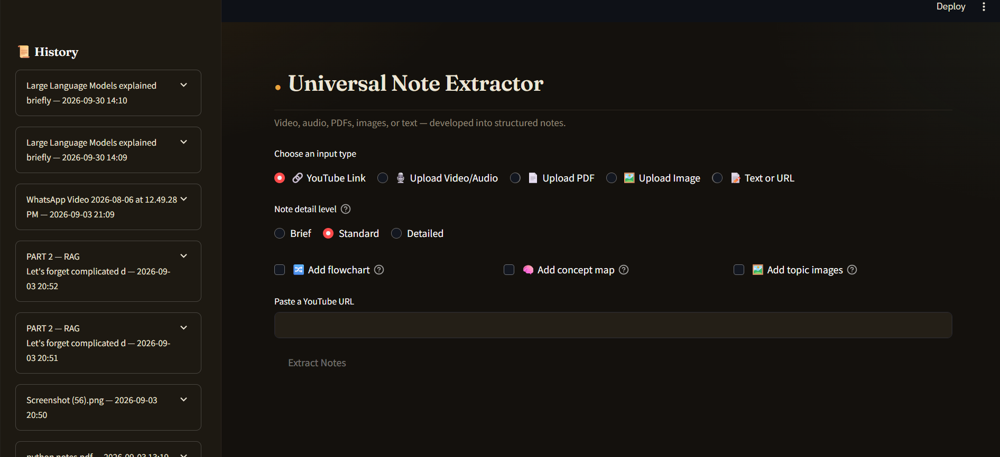
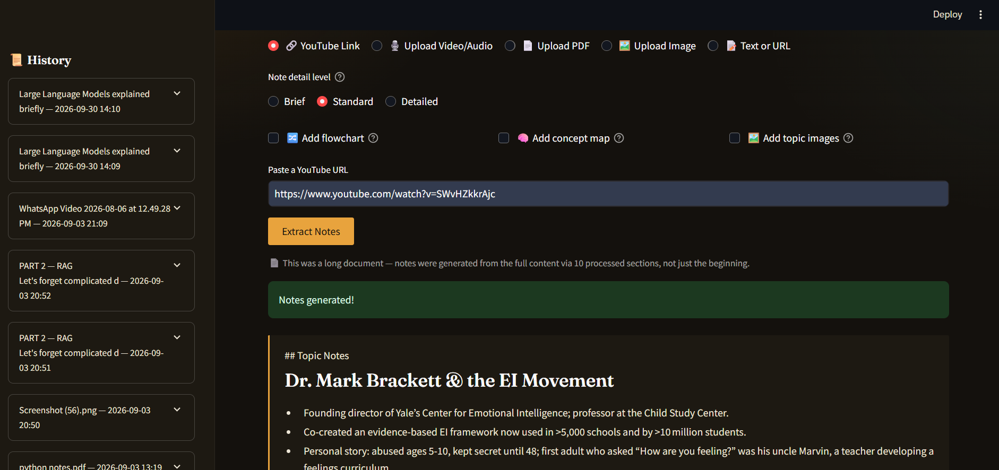
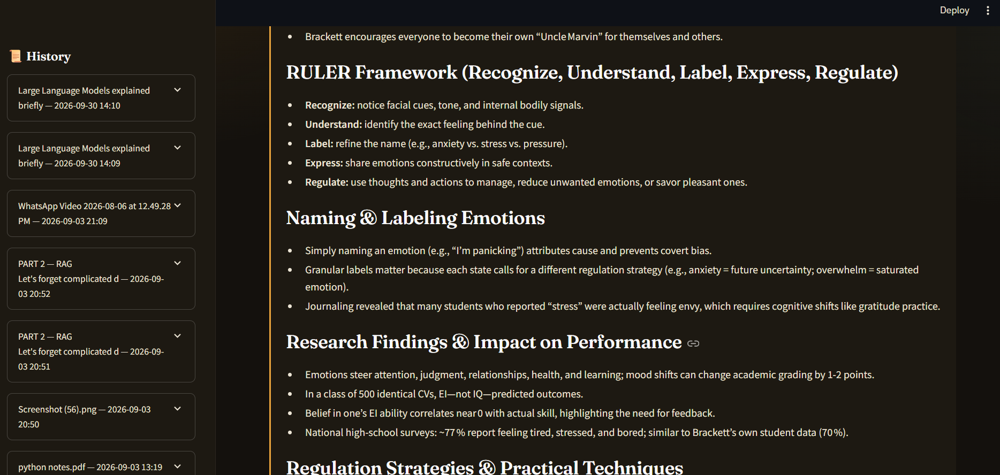
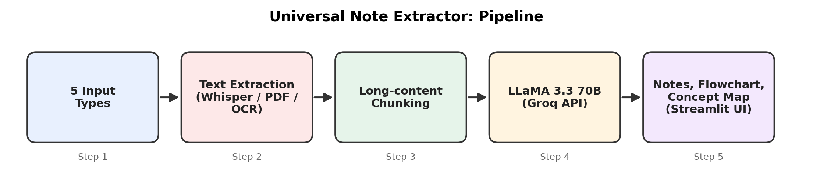

<div align="center">

# 🎓 Universal Note Extractor

**Turn videos, audio, PDFs, images, or plain text into clean, structured notes in one click, powered by Whisper and LLaMA 3.3 70B.**


-orange)




</div>

---

## 📌 Overview

Revising from long lectures, tutorials, and documents is slow. **Universal Note Extractor** accepts content from **five input types**, converts it to text, and uses **LLaMA 3.3 70B (via Groq)** to generate structured, easy-to-revise notes. Long content is processed section by section, so notes cover the full material and not just the beginning.

---

## ✨ Key Features

- 🎥 **Five input types:** YouTube link, video/audio upload, PDF, image, and text or URL
- 🗣️ **Accurate transcription** of speech using OpenAI Whisper
- 🎚️ **Adjustable detail level:** Brief, Standard, or Detailed notes
- 🔀 **Optional flowchart** to visualise processes
- 🧠 **Optional concept map** to show how ideas connect
- 🖼️ **Optional topic images** to enrich the notes
- 📚 **Long-document handling:** content is split into sections and processed fully
- 📜 **History sidebar** to revisit previously generated notes
- ⚡ **Fast inference** thanks to the Groq API

---

## 🖼️ Screenshots

**Choose an input type, detail level, and extras**


**Notes generated from a YouTube lecture**



**Structured output with headings and key points**



---

## 🏗️ How It Works

<div align="center">



</div>

1. **Input:** the user picks a source (YouTube, video/audio, PDF, image, or text/URL).
2. **Extraction:** Whisper transcribes audio and video; PDFs, images, and text are parsed into plain text.
3. **Chunking:** long content is split into sections so nothing is skipped.
4. **Generation:** LLaMA 3.3 70B writes structured notes at the chosen detail level, with optional flowchart, concept map, and images.
5. **Output:** notes are displayed in the Streamlit app and saved to history.

---

## 🧰 Tech Stack

| Layer | Tools |
|-------|-------|
| Language | Python |
| LLM | LLaMA 3.3 70B via Groq API |
| Speech-to-Text | OpenAI Whisper |
| Frontend | Streamlit |
| Version Control | Git, GitHub |

---

## 📁 Project Structure

```
video-note-extractor/
├── app.py              # Streamlit app
├── test_groq.py        # Groq API connection test
├── requirements.txt
├── assets/             # README images
└── README.md
```

---

## 🚀 Getting Started

### Prerequisites
- Python 3.10+
- [FFmpeg](https://ffmpeg.org/download.html) installed and on your PATH
- A free [Groq API key](https://console.groq.com/)

### Installation
```bash
git clone https://github.com/zananyagupta25-afk/video-note-extractor.git
cd video-note-extractor
python -m venv venv
venv\Scripts\activate          # Mac/Linux: source venv/bin/activate
pip install -r requirements.txt
```

### Configuration
Create a `.env` file in the project root:
```env
GROQ_API_KEY=your_api_key_here
```

### Run
```bash
streamlit run app.py
```
Open `http://localhost:8501` in your browser.

---

## 📖 Usage

1. Select an input type.
2. Choose the note detail level: Brief, Standard, or Detailed.
3. Optionally tick **Add flowchart**, **Add concept map**, or **Add topic images**.
4. Paste a link or upload a file, then click **Extract Notes**.
5. Read your notes, or reopen older ones from the **History** sidebar.

---

## 🧗 Challenges and Learnings

- **Unifying five input formats** into one clean text pipeline.
- **Handling long content** that exceeds the model's context limit by processing it in sections.
- **Deployment:** moved the interface to Streamlit for simple hosting and a smoother experience.

---

## 🔮 Future Improvements

- [ ] Question-answering over the generated notes
- [ ] Export notes to PDF / Markdown
- [ ] Multi-language transcription and translation
- [ ] Timestamped notes linking back to the video

---

## 👩‍💻 Author

**Ananya Gupta**, B.Tech AI & ML
[LinkedIn](https://www.linkedin.com/in/ananya-gupta-8b7023369) · [GitHub](https://github.com/zananyagupta25-afk)

---

## 📄 License

This project is open source under the [MIT License](LICENSE).
